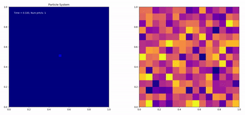

# Branching random walks in a random environment

Fix an environment, that is a collection  of i.i.d. random variables.

We simulate a system of particles (in dimension ) which, independently of each other:

- Perform a random walk (in 1 or 2 dimensions)

- Branch with a rate proportional to the value of a random (white) potential
at the location of the particle. That is, if  is the position of the
particle at time :

  - The probability of producing a new offspring is proportional to .
  - The probability of dying is proportional to .

The simulation of this system is straightforward. The heart is implemented in C
to be able to simulate large quantities of particles. The C code is imported in
Python with Cython, where pictures and short movies can be produced. Both
dimensions work essentially in the same way.

__Description of the programs (2D case only)__

- The particle system at fixed time is a C list (these are defined in
  my_2D_list.c / my_2D_list.h)

- The particle system is run in brwre_black_2D.c, which takes as an input the
  random environment and a set of externally generated pseudo-random variables.
  The particle system runs until there are no more unused random variables.

- The C code is embedded in Python in brwre_2D.pyx (which can be run with
  setup.py - see instructions in file). Here the output is a movie. The
  particle system is run at under diffusive scaling.

Motivation for this simulation was the study of the scaling limit of the
particle system:

- https://arxiv.org/abs/1905.05825

- https://arxiv.org/abs/1906.11054

Small number of particles:

Large number of particles:

